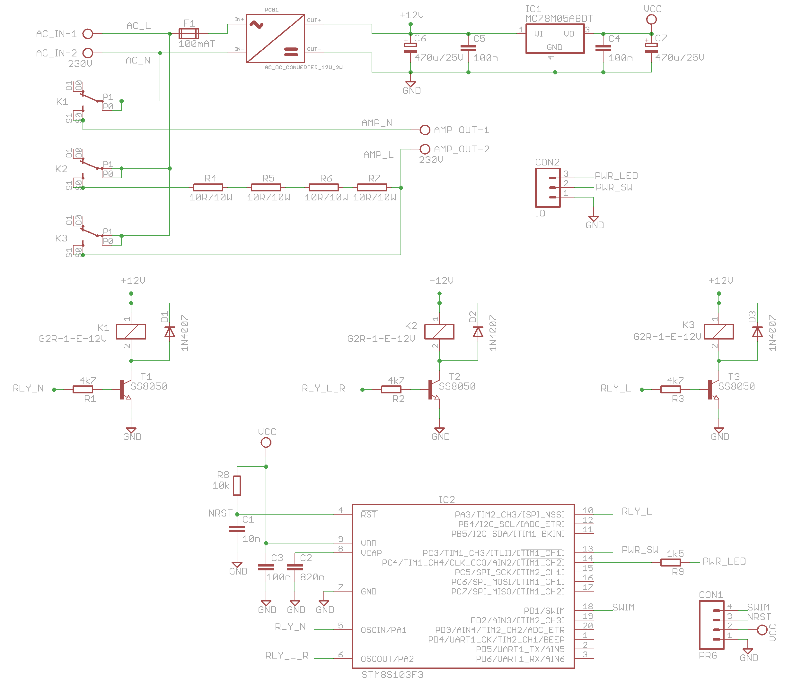
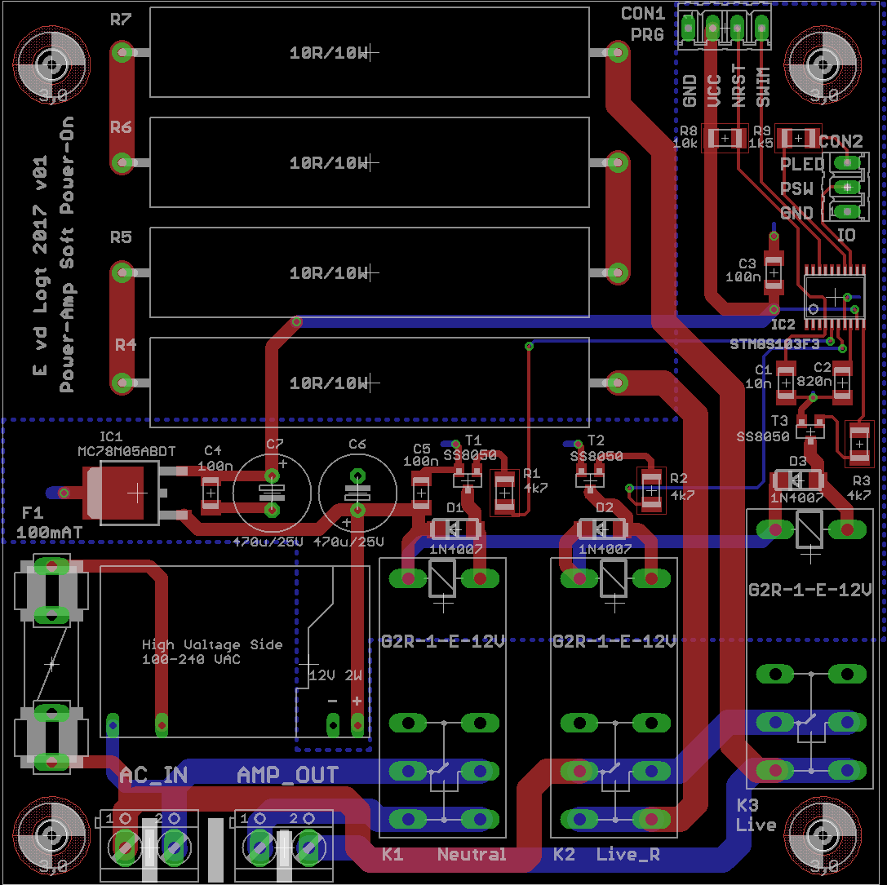

Soft Power-On for Power-Amps (SPOPA)
==========

This project is meant for a 300 W stereo power-amp, but can be used for any power-amp. It's purpose is the following:
- Use a push-button switch with a LED for powering the power-amp on and off. The switch can be of any type, since it need not switch any high currents
- Energise the power-supply by connecting it to power-resistors prior to connecting it to mains

Switching is done with 3 relays, so that the power-amp is fully disconnected from any mains voltage when not in use. A small **STM8S103F3** microcontroller (µC) is used. Since the power-supply for the µC is always on, a
small and efficient switched mode power-supply is used (12V/2W). This is easily found on ebay (search for: "100-240V AC to DC 12V 2W Step-down Buck Power Supply Module").

Software Development Environment
-----------
- Cosmic STM8 compiler. A license can be obtained free of charge from Cosmic-software.com. Install this first.
- ST Visual Develop (STVD). This can be obtained free of charge from st.com
- A coloured ST-Link V2 USB adapter (which are very cheap to find on ebay)

Software Design
-------------------
Software Design is simple: there's a task scheduler with only one task, that runs every 100 msec. This task contains a State Transition Diagram (STD) with the following states:
- STD_PWR_OFF: all relays are off and the power-switch LED is off. If the power-switch is pressed (rising edge), the new state will be STD_PWR_N
- STD_PWR_N: in this state the relay for the neutral wire is energised. You don't want to switch all relays at the same time. Next state is STD_L_R_ON.
- STD_L_R_ON: in this state the relay for the live wire connected through the power-resistors is energised. A timer is started and if it times-out (>= 1 second), next state will be STD_PWR_ON. When the timer is running, the power switch LED is blinking.
- STD_PWR_ON: in this state the live wire is directly connected to the power-amp. After a short delay (5 msec.), the power-resistors relay is switched off. This is normal operation, if the switch is pressed again, the next state will be STD_PWR_OFF1.
- STD_PWR_OFF1: the relay for the live wire is switched-off. The power-switch LED starts to blink. Next state is STD_PWR_OFF2
- STD_PWR_OFF2: the relay for the neutral wire is switched-off, the power-amp is completely disconnected from mains. Next state is STD_PWR_OFF.

Main functionality is in main.c. Timer 2 is used for the scheduler timing and has an interrupt frequency of 1 kHz.

Hardware PCB
--------------
Here's the first version of the schematic for this project.

 
*Eagle schematics for this project*

 
*Eagle PCB for this project, v01*

Current status: Gerber files sent to PCB manufacturer.

Updates
-------

|Date|Release|Description|
|----|-------|-----------|
|2017-05-26|v1.00|First release |

